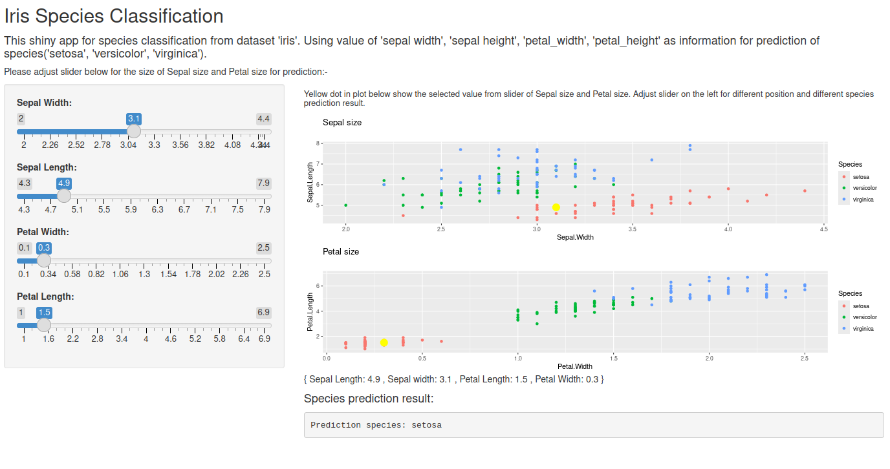
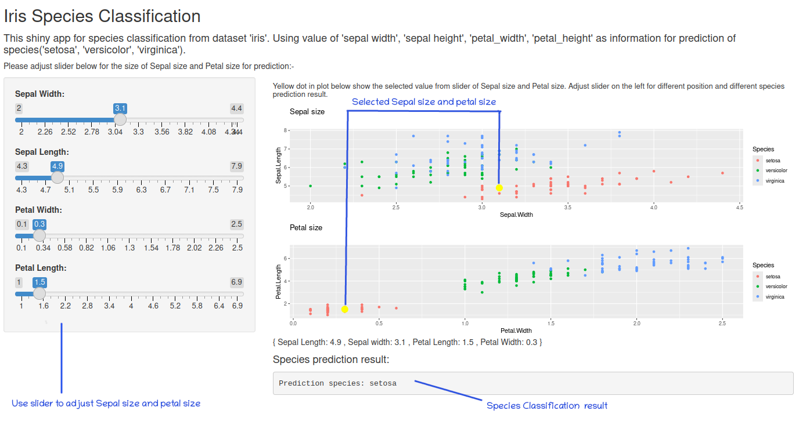

```{r setup, include=FALSE}
knitr::opts_chunk$set(echo = FALSE)
```

## What is species classification application?

Species classification application on IRIS data, this app use dataset 'iris' for species classification. We use 'Sepal.Length', 'Sepal.Width', 'Petal.Length', 'Petal.Width' as key features for species classification.

In this app, you can try to adjust value of Sepal size(width/height), Petal size(width/height) in order to predict species of iris might be classified.

Try with our classification ( [iris species classification application](https://naddao.shinyapps.io/iris_classification/) )\
[](https://naddao.shinyapps.io/iris_classification/)

## Guidance for using species classification application. 


## Example data from iris dataset for train our prediction model.
We uses 'Sepal.Length', 'Sepal.Width', 'Petal.Length', 'Petal.Width' as key features for prediction model to make 'Species' prediction on this iris data.
```{r, echo=TRUE}
data_validation <- readRDS("data_validation.rds")
head(data_validation)
```
## We use SVM algorithm to train prediction model for species classification.

```{r, echo = FALSE, results='hide'}
library(caret)
library(dplyr)
```

```{r, echo = TRUE, results="hide"}
model_svm <- readRDS("model_svm.rds")
pre_obj_normalized <- readRDS("pre_obj_normalized.rds")


# standardize validation data
normalized_validation_data <- predict(pre_obj_normalized, data_validation)
prepared_data_validation <- normalized_validation_data %>% select(-c("Species"))

# prediction species by our train model
prediction_result <- predict(model_svm, prepared_data_validation, na.action = na.omit)
validation_confusion_matrix <- confusionMatrix(as.factor(prediction_result), as.factor(data_validation$Species))

validation_confusion_matrix
```

## Accuracy of our prediction model on validation data is 96.67%

```{r, echo = FALSE, results='markup'}
model_svm <- readRDS("model_svm.rds")
pre_obj_normalized <- readRDS("pre_obj_normalized.rds")
data_validation <- readRDS("data_validation.rds")

# standardize validation data
normalized_validation_data <- predict(pre_obj_normalized, data_validation)
prepared_data_validation <- normalized_validation_data %>% select(-c("Species"))

# prediction species by our train model
prediction_result <- predict(model_svm, prepared_data_validation, na.action = na.omit)
validation_confusion_matrix <- confusionMatrix(as.factor(prediction_result), as.factor(data_validation$Species))

validation_confusion_matrix
```
